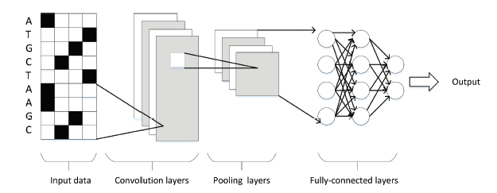

```{r setup, include=FALSE}
knitr::opts_chunk$set(echo = TRUE)
```

\tableofcontents


# Introduction

CNNs were first proposed by LeCun in 1989. In recent years,
CNNs have been successfully applied in many fields, including
speech recognition, face recognition, general object recognition,
motion analysis and natural language processing. CNNs have
also played an important role in omics research, including gene
expression prediction, protein classification and gene structure
prediction.
In general, CNNs consist ofmultiple convolution layers, pooling
layers and a full connection layer. A simple CNN structure
is shown in Figure. The function of a convolution operation
is to extract the various features of the data. In the process of
convolution, a convolution kernel can slide on the input window
so that the weight parameters on the convolution kernel are
multiplied by the corresponding pixels. Then, the results follow
multiplication. The role of the pooling layer is to abstract the
original characteristic signal, which greatly reduces the training
parameters and can also reduce the degree of overfitting. Pooling
operations can be divided into two categories: max-pooling and
mean-pooling. Max-pooling involves selecting the largest value
of a corresponding pixel as a sampling result, andmean-pooling
involves calculating the average value of the corresponding pixel
as the sampling result.


Compared to other models, CNNs have the outstanding
ability to analyze spatial information and require less data
preprocessing steps. Therefore, CNNs are particularly good for
manipulating image data, and encoding omics data into two dimensional
image matrices is often quite easy. CNNs have
made good achievements in the identification of various gene
sequence structures, such as protein binding sites and enhancer
sequences (Fig. 1)


{width=80%}


Deep learning has a lot of potential in the field of genetic data. This is an exercise where
shows how to use a deep learning model to approximate one of the problems in the field of
functional genomics: discover the binding sites of DNA transcription factors binding sites (TFBS), see Fig.2. Thus, a neural network will be designed that can discover DNA junctions based on the results of some essays; in this case the DNA sequences will be the predictive variables while the response positive or negative test will be the response variable. 

{width=70%}

The data consists of DNA sequences from
50 bases in length and will be labeled with a 0 or a 1 depending on the result. The goal is to obtain a classifier that can predict whether a particular sequence will be a TFBS for a certain protein.
The next step is to prepare the data to be introduced in the model; in this case, the data must be transformed so that it is organized in an array.

**Sequences**

https://raw.githubusercontent.com/abidlabs/deep-learning-genomics-primer/master/sequences.txt

**Labels**

https://raw.githubusercontent.com/abidlabs/deep-learning-genomics-primer/master/labels.txt


The database is made up of 2000 sequences of 50 bases each. First, each base will be indicated in a 4-dimensional vector, where there will be a 1 where the base corresponds: when there is an A the vector will be [1,0,0,0], a C [0, 1,0 , 0], the T with [0,0,1,0] and finally the G formed for [0,0,0,1]. Next, all these 4-dimensional vectors are concatenated along the sequence to form a matrix.

In this case, the tags are formed by a "1" that indicates that the protein binds to the sequence while a "0" means no.

The structure that follows the response variable is the same as the data: each value is transformed into a 2-dimensional vector, that if the vector is [1,0], the value is "0" and if it is [0,1] It's value is a "1".


```{r}
library(keras)
```

# Data
```{r}
#setwd("C:/Users/User/Documents/curs19_20/UB/SLT/PracticaTFBS")
labels<-read.delim("labels.txt",header = F)
sequences<-read.delim("sequences.txt",header = F)
```


# Data preparation (One-hot encoding)

The first objective will be to recode these sequences so that instead of working with ACTG letters, we work with codes 1s and 0s. For this, each letter will be assigned a sequence of 4 numbers:


A: 1000

C: 0100

T: 0010

G: 0001


We can use these code lines to implement the one-hot encoding.


```{r}
sequences <- apply(sequences, 2, as.character)
sequences <- gsub("A", "1000", sequences)
sequences <- gsub("C", "0100", sequences)
sequences <- gsub("T", "0010", sequences)
sequences <- gsub("G", "0001", sequences)
sequences <- gsub("1", "1 ", sequences)
sequences <- gsub("0", "0 ", sequences)
sequences2 <- lapply(strsplit(sequences, " "), as.numeric)
sequences2 <- matrix(unlist(sequences2), nrow=2000, byrow=T)
```

Once we have the transformed data, we need to create the arrays so that the network understands them as such


```{r}
labels.cat <- to_categorical(labels[,1])
x <- array_reshape(sequences2,dim=c(2000,200,1))
```


Specifically, the neural network that we will define will be the following:


```{r}
model <- keras_model_sequential() %>%
layer_conv_1d(filters=32, kernel_size=12, activation = "relu", input_shape=c(200, 1)) %>%
layer_max_pooling_1d(pool_size = 16) %>%
layer_flatten() %>%
layer_dense(units = 12, activation = 'relu') %>%
layer_dense(units = 2, activation = 'softmax')
summary(model)
```

# Training

We will separate the sequences into 2 groups (training and validation). We will train the network with the training group and once trained we will validate it with the validation group.

Our training will consist of 90% of the observations. The rest will be part of the validation set.

```{r}
# 90% training, 10% validation
perc.training <- 0.9
num.train <- nrow(sequences2)*perc.training

# Divir train y validation
x_train <- array_reshape(sequences2[1:num.train,], dim=c(num.train, 200, 1))
x_test  <- array_reshape(sequences2[(num.train + 1):nrow(sequences2),], dim=c((nrow(sequences2)-num.train), 200, 1))
labels.cat_train <- to_categorical(labels[1:num.train, 1])
labels.cat_test  <- to_categorical(labels[(num.train + 1):nrow(sequences2), 1])
```

Once divided into training and validation, we can now train the network with the optimal parameters previously chosen (Here we don't implement tunning hyperparameter).

```{r}
model %>% compile(
loss = 'categorical_crossentropy',
optimizer = optimizer_rmsprop(),
metrics = c('accuracy')
)
```

```{r, results=FALSE}
history <- model %>% fit(
              x_train, labels.cat_train,
              epochs = 25, batch_size = 32,
              validation_split = 0.2
            )

```

```{r, results=FALSE}
plot(history)
```
 
As we see in the graph from 20 epochs the network has already stabilized and when the network is finished it has a predictive power of practically 100% for the sequences used.
 
 
# Predictions
 
Now what is interesting once the model is trained is to see its precision and loss value in the 200 sequences that have not been used to train the network.


```{r}
model %>% evaluate(x_test, labels.cat_test)
```
We see that we have an accuracy of around 95%.

Next we have the predictions of the 200 sequences that we use externally to validate the model.


```{r, eval=T}
head(predict(model, x_test))
```

We can conclude that we have obtained a very predictive network which also works well for any such sequence that may enter. That is, it is not overfited.

